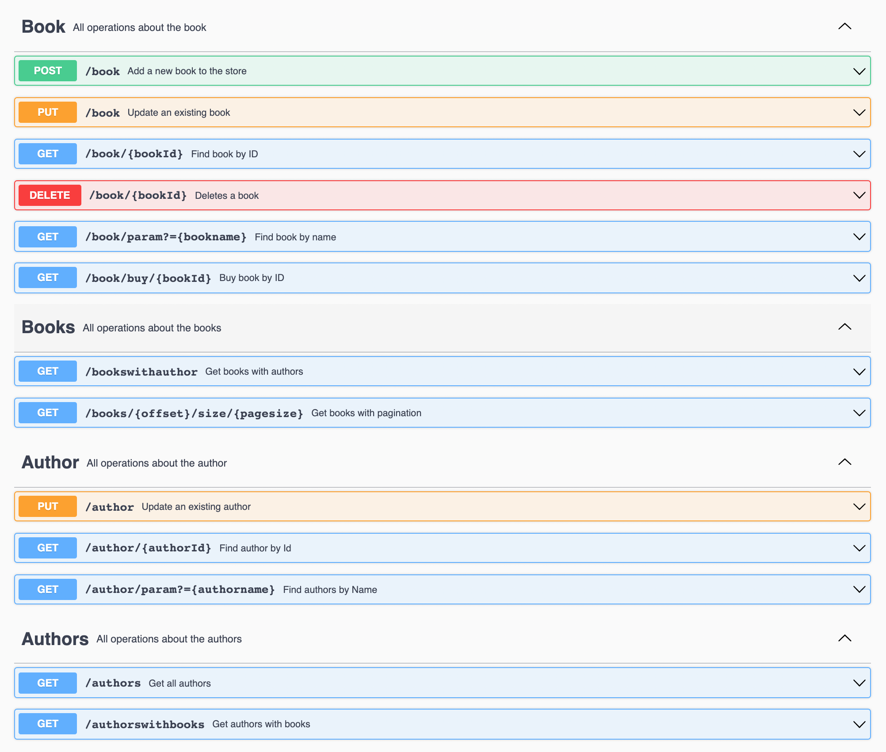

# Week 5 | Week 

This work is the fifth week of the [Picus Security](https://www.picussecurity.com) Golang Backend Web Development Bootcamp

## Installation
```bash
git clone https://github.com/Picus-Security-Golang-Bootcamp/homework-4-week-5-hkaya15.git
```
## Swagger



## License
[MIT](https://mit-license.org)
